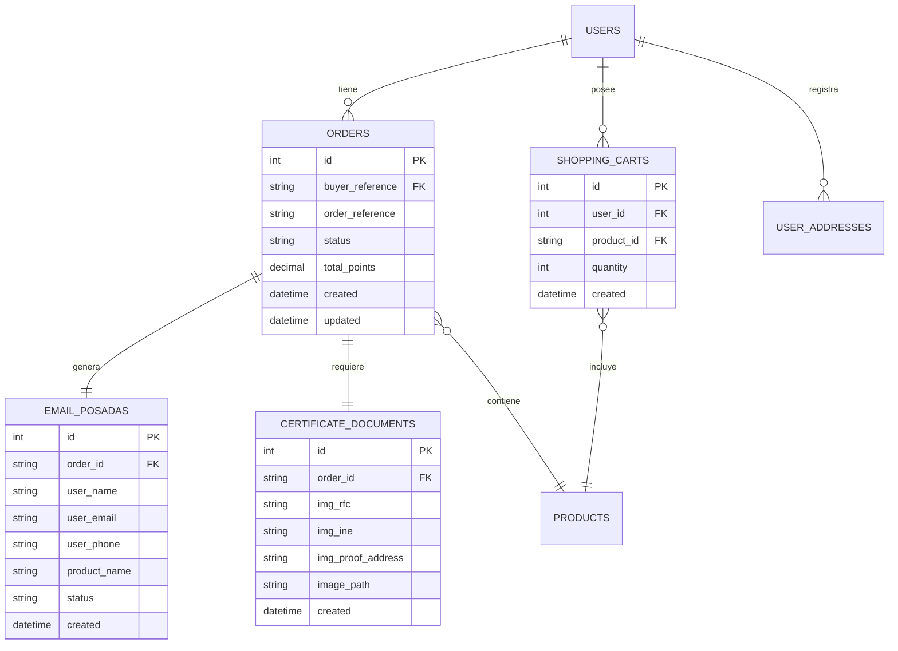

# Tablas de Base de Datos

El sistema de órdenes de compra utiliza varias tablas para gestionar el flujo completo desde el carrito hasta la entrega final.

## Diagrama de Relaciones



## Tabla: Orders

Almacena todas las órdenes de compra generadas por el sistema.

### Estructura

<ParamField path="id" type="integer" required>
Identificador único de la orden (Primary Key, Auto-increment)
</ParamField>

<ParamField path="buyer_reference" type="string" required>
Referencia del comprador (ID del usuario que realizó la orden)
</ParamField>

<ParamField path="order_reference" type="string" required>
Referencia única de la orden generada por el microservicio
</ParamField>

<ParamField path="product_id" type="string" required>
Identificador del producto canjeado
</ParamField>

<ParamField path="product_name" type="string" required>
Nombre del producto al momento de la orden
</ParamField>

<ParamField path="product_quantity" type="integer" required>
Cantidad de productos en la orden
</ParamField>

<ParamField path="total_points" type="decimal" required>
Total de puntos utilizados en la orden
</ParamField>

<ParamField path="status" type="string" required>
Estado actual de la orden (PENDING, PROCESSING, SHIPPED, DELIVERED, CANCELLED)
</ParamField>

<ParamField path="microservice_response" type="text">
Respuesta completa del microservicio almacenada como JSON
</ParamField>

<ParamField path="created" type="datetime" required>
Fecha y hora de creación de la orden
</ParamField>

<ParamField path="updated" type="datetime">
Fecha y hora de última actualización
</ParamField>

### Ejemplo de Registro

<ResponseExample>
```json Orden Típica
{
  "id": 1234,
  "buyer_reference": "USR789012",
  "order_reference": "ORD-2024-001234",
  "product_id": "LAPTOP001",
  "product_name": "Laptop HP Pavilion 15\"",
  "product_quantity": 1,
  "total_points": 15000.00,
  "status": "PENDING",
  "microservice_response": "{\"order_id\":\"ORD-2024-001234\",\"status\":\"success\"}",
  "created": "2024-03-15 10:30:00",
  "updated": "2024-03-15 10:30:00"
}
```
</ResponseExample>

### Estados de Orden

<Tabs>
<Tab title="PENDING">
**Descripción**: Orden creada, esperando procesamiento  
**Siguiente Estado**: PROCESSING  
**Acciones**: Notificación enviada al usuario
</Tab>

<Tab title="PROCESSING">
**Descripción**: Orden en proceso de preparación  
**Siguiente Estado**: SHIPPED  
**Acciones**: Preparación del producto para envío
</Tab>

<Tab title="SHIPPED">
**Descripción**: Orden enviada al usuario  
**Siguiente Estado**: DELIVERED  
**Acciones**: Número de tracking disponible
</Tab>

<Tab title="DELIVERED">
**Descripción**: Orden entregada exitosamente  
**Estado Final**: Sí  
**Acciones**: Confirmación de entrega
</Tab>

<Tab title="CANCELLED">
**Descripción**: Orden cancelada  
**Estado Final**: Sí  
**Acciones**: Reembolso de puntos
</Tab>
</Tabs>

## Tabla: ShoppingCarts

Gestiona los productos agregados al carrito de compras de cada usuario.

### Estructura

<ParamField path="id" type="integer" required>
Identificador único del item en carrito (Primary Key, Auto-increment)
</ParamField>

<ParamField path="user_id" type="integer" required>
ID del usuario propietario del carrito (Foreign Key)
</ParamField>

<ParamField path="product_id" type="string" required>
Identificador del producto en el carrito
</ParamField>

<ParamField path="product_name" type="string" required>
Nombre del producto (cache para evitar consultas)
</ParamField>

<ParamField path="product_price" type="decimal" required>
Precio en puntos del producto (cache)
</ParamField>

<ParamField path="quantity" type="integer" required>
Cantidad del producto en el carrito
</ParamField>

<ParamField path="created" type="datetime" required>
Fecha y hora cuando se agregó al carrito
</ParamField>

<ParamField path="updated" type="datetime">
Fecha y hora de última actualización de cantidad
</ParamField>

### Operaciones Comunes

<CodeGroup>
```sql Agregar Producto
INSERT INTO shopping_carts (
    user_id, 
    product_id, 
    product_name, 
    product_price, 
    quantity, 
    created
) VALUES (
    123, 
    'LAPTOP001', 
    'Laptop HP Pavilion', 
    15000.00, 
    1, 
    NOW()
);
```

```sql Actualizar Cantidad
UPDATE shopping_carts 
SET quantity = quantity + 1, 
    updated = NOW() 
WHERE user_id = 123 
  AND product_id = 'LAPTOP001';
```

```sql Vaciar Carrito
DELETE FROM shopping_carts 
WHERE user_id = 123;
```

```sql Obtener Carrito
SELECT 
    product_id,
    product_name,
    product_price,
    quantity,
    (product_price * quantity) as total_price
FROM shopping_carts 
WHERE user_id = 123 
ORDER BY created DESC;
```
</CodeGroup>

## Tabla: EmailPosadas

Registra órdenes de productos especiales de la línea Posada que requieren seguimiento manual.

### Estructura

<ParamField path="id" type="integer" required>
Identificador único del registro (Primary Key, Auto-increment)
</ParamField>

<ParamField path="order_id" type="string" required>
ID de la orden asociada (Foreign Key hacia Orders)
</ParamField>

<ParamField path="user_name" type="string" required>
Nombre completo del usuario
</ParamField>

<ParamField path="user_email" type="string" required>
Email del usuario para contacto
</ParamField>

<ParamField path="user_phone" type="string" required>
Teléfono del usuario para coordinación
</ParamField>

<ParamField path="product_name" type="string" required>
Nombre del producto Posada canjeado
</ParamField>

<ParamField path="status" type="string" required>
Estado del seguimiento (PENDING, CONTACTED, CONFIRMED, COMPLETED)
</ParamField>

<ParamField path="notes" type="text">
Notas adicionales del seguimiento manual
</ParamField>

<ParamField path="created" type="datetime" required>
Fecha y hora de creación del registro
</ParamField>

<ParamField path="updated" type="datetime">
Fecha y hora de última actualización
</ParamField>

### Productos Posada Identificados

<Info>
Los productos Posada se identifican automáticamente por su SKU y se registran en esta tabla para seguimiento especial.
</Info>

| SKU | Producto | Tipo de Seguimiento |
|-----|----------|-------------------|
| `GP-KTS01` | Kit Posada Básico | Email + Teléfono |
| `GP-PKTS02` | Paquete Posada Premium | Email + Teléfono |
| `GP-KTS03` | Kit Posada Familiar | Email + Teléfono |

### Proceso de Registro

<CodeGroup>
```php Detección Automática
// En el controlador de órdenes
if (in_array($product->sku, ['GP-KTS01', 'GP-PKTS02', 'GP-KTS03'])) {
    $emailPosada = $this->EmailPosadas->newEntity([
        'order_id'      => $order->id,
        'user_name'     => $profile->first_names . ' ' . $profile->last_names,
        'user_email'    => $profile->email,
        'user_phone'    => $profile->cellphone,
        'product_name'  => $product->name,
        'status'        => 'PENDING',
        'created'       => new DateTime()
    ]);
    
    $this->EmailPosadas->save($emailPosada);
}
```

```sql Consulta de Seguimiento
SELECT 
    ep.*,
    o.order_reference,
    o.status as order_status
FROM email_posadas ep
JOIN orders o ON ep.order_id = o.id
WHERE ep.status = 'PENDING'
ORDER BY ep.created ASC;
```
</CodeGroup>

## Tabla: CertificateDocuments

Almacena los documentos requeridos para productos CEVER (certificados de regalo).

### Estructura

<ParamField path="id" type="integer" required>
Identificador único del registro (Primary Key, Auto-increment)
</ParamField>

<ParamField path="order_id" type="string" required>
ID de la orden asociada (Foreign Key hacia Orders)
</ParamField>

<ParamField path="img_rfc" type="string" required>
Nombre del archivo de imagen del RFC
</ParamField>

<ParamField path="img_ine" type="string" required>
Nombre del archivo de imagen del INE
</ParamField>

<ParamField path="img_proof_address" type="string" required>
Nombre del archivo de imagen del comprobante de domicilio
</ParamField>

<ParamField path="image_path" type="string" required>
Ruta base donde se almacenan las imágenes
</ParamField>

<ParamField path="verification_status" type="string">
Estado de verificación de documentos (PENDING, APPROVED, REJECTED)
</ParamField>

<ParamField path="verification_notes" type="text">
Notas del proceso de verificación
</ParamField>

<ParamField path="created" type="datetime" required>
Fecha y hora de creación del registro
</ParamField>

<ParamField path="updated" type="datetime">
Fecha y hora de última actualización
</ParamField>

### Almacenamiento de Documentos

<Warning>
Los documentos se almacenan como archivos PNG en el sistema de archivos, no en la base de datos.
</Warning>

<CodeGroup>
```php Guardado de Documentos
public function saveCeverDocuments($order_id, $documents) {
    $upload_path = Configure::read('App.uploadsPath') . 'cever_documents/';
    
    // Crear directorio si no existe
    if (!is_dir($upload_path)) {
        mkdir($upload_path, 0755, true);
    }
    
    // Procesar cada documento
    $rfc_file = $this->saveBase64Image($documents['rfc'], $upload_path, 'rfc_' . $order_id);
    $ine_file = $this->saveBase64Image($documents['ine'], $upload_path, 'ine_' . $order_id);
    $voucher_file = $this->saveBase64Image($documents['domicilio'], $upload_path, 'voucher_' . $order_id);
    
    // Guardar registro en BD
    $certificateDoc = $this->CertificateDocuments->newEntity([
        'order_id'              => $order_id,
        'img_rfc'               => $rfc_file,
        'img_ine'               => $ine_file,
        'img_proof_address'     => $voucher_file,
        'image_path'            => $upload_path,
        'verification_status'   => 'PENDING',
        'created'               => new DateTime()
    ]);
    
    return $this->CertificateDocuments->save($certificateDoc);
}
```

```php Recuperación de Documentos
public function getCeverDocuments($order_id) {
    $docs = $this->CertificateDocuments
        ->find()
        ->where(['order_id' => $order_id])
        ->first();
    
    if (!$docs) {
        return null;
    }
    
    return [
        'rfc_path' => $docs->image_path . $docs->img_rfc,
        'ine_path' => $docs->image_path . $docs->img_ine,
        'address_proof_path' => $docs->image_path . $docs->img_proof_address,
        'verification_status' => $docs->verification_status
    ];
}
```
</CodeGroup>

### Productos CEVER

| SKU | Valor | Documentos Requeridos |
|-----|-------|----------------------|
| `CEVER15` | $1,500 MXN | RFC + INE + Comprobante |
| `CEVER25` | $2,500 MXN | RFC + INE + Comprobante |
| `CEVER50` | $5,000 MXN | RFC + INE + Comprobante |

## Tabla: UserAddresses

Almacena las direcciones de entrega registradas por los usuarios.

### Estructura

<ParamField path="id" type="integer" required>
Identificador único de la dirección (Primary Key, Auto-increment)
</ParamField>

<ParamField path="user_id" type="integer" required>
ID del usuario propietario (Foreign Key)
</ParamField>

<ParamField path="country" type="string" required>
País de la dirección
</ParamField>

<ParamField path="state" type="string" required>
Estado de la dirección
</ParamField>

<ParamField path="city" type="string" required>
Ciudad de la dirección
</ParamField>

<ParamField path="street" type="string" required>
Calle de la dirección
</ParamField>

<ParamField path="ext_number" type="string" required>
Número exterior
</ParamField>

<ParamField path="int_number" type="string">
Número interior (opcional)
</ParamField>

<ParamField path="postal_code" type="string" required>
Código postal
</ParamField>

<ParamField path="reference" type="string">
Referencias adicionales para ubicación
</ParamField>

<ParamField path="is_default" type="boolean" required>
Indica si es la dirección predeterminada del usuario
</ParamField>

<ParamField path="created" type="datetime" required>
Fecha y hora de creación
</ParamField>

<ParamField path="updated" type="datetime">
Fecha y hora de última actualización
</ParamField>

### Gestión de Direcciones

<CodeGroup>
```sql Dirección Predeterminada
SELECT * FROM user_addresses 
WHERE user_id = 123 
  AND is_default = 1 
LIMIT 1;
```

```sql Establecer Nueva Predeterminada
-- Quitar predeterminada actual
UPDATE user_addresses 
SET is_default = 0 
WHERE user_id = 123;

-- Establecer nueva predeterminada
UPDATE user_addresses 
SET is_default = 1, updated = NOW() 
WHERE id = 456 AND user_id = 123;
```

```sql Todas las Direcciones del Usuario
SELECT 
    id,
    CONCAT(street, ' ', ext_number, 
           CASE WHEN int_number IS NOT NULL 
                THEN CONCAT(' Int. ', int_number) 
                ELSE '' END) as full_address,
    city,
    state,
    postal_code,
    is_default
FROM user_addresses 
WHERE user_id = 123 
ORDER BY is_default DESC, created DESC;
```
</CodeGroup>

## Índices y Optimizaciones

### Índices Recomendados

<AccordionGroup>
<Accordion title="Tabla Orders">
```sql
-- Índice por usuario y estado
CREATE INDEX idx_orders_buyer_status ON orders(buyer_reference, status);

-- Índice por fecha de creación
CREATE INDEX idx_orders_created ON orders(created);

-- Índice por referencia de orden
CREATE UNIQUE INDEX idx_orders_reference ON orders(order_reference);
```
</Accordion>

<Accordion title="Tabla ShoppingCarts">
```sql
-- Índice compuesto para consultas de carrito
CREATE INDEX idx_cart_user_product ON shopping_carts(user_id, product_id);

-- Índice por usuario para operaciones de carrito
CREATE INDEX idx_cart_user ON shopping_carts(user_id);
```
</Accordion>

<Accordion title="Tabla EmailPosadas">
```sql
-- Índice por estado para seguimiento
CREATE INDEX idx_posadas_status ON email_posadas(status);

-- Índice por orden
CREATE INDEX idx_posadas_order ON email_posadas(order_id);
```
</Accordion>

<Accordion title="Tabla CertificateDocuments">
```sql
-- Índice por orden
CREATE UNIQUE INDEX idx_cert_docs_order ON certificate_documents(order_id);

-- Índice por estado de verificación
CREATE INDEX idx_cert_docs_status ON certificate_documents(verification_status);
```
</Accordion>
</AccordionGroup>

### Consultas de Rendimiento

<Tip>
Para mejorar el rendimiento, considera estas consultas optimizadas para operaciones comunes.
</Tip>

<CodeGroup>
```sql Dashboard de Órdenes
SELECT 
    COUNT(*) as total_orders,
    SUM(CASE WHEN status = 'PENDING' THEN 1 ELSE 0 END) as pending_orders,
    SUM(CASE WHEN status = 'DELIVERED' THEN 1 ELSE 0 END) as delivered_orders,
    SUM(total_points) as total_points_used
FROM orders 
WHERE buyer_reference = 'USR123456'
  AND created >= DATE_SUB(NOW(), INTERVAL 30 DAY);
```

```sql Productos Más Canjeados
SELECT 
    product_id,
    product_name,
    COUNT(*) as order_count,
    SUM(product_quantity) as total_quantity,
    AVG(total_points) as avg_points
FROM orders 
WHERE created >= DATE_SUB(NOW(), INTERVAL 90 DAY)
  AND status != 'CANCELLED'
GROUP BY product_id, product_name
ORDER BY order_count DESC
LIMIT 10;
```
</CodeGroup>

<Check>
Esta estructura de base de datos soporta eficientemente todo el flujo de órdenes de compra, desde el carrito hasta la entrega final.
</Check>