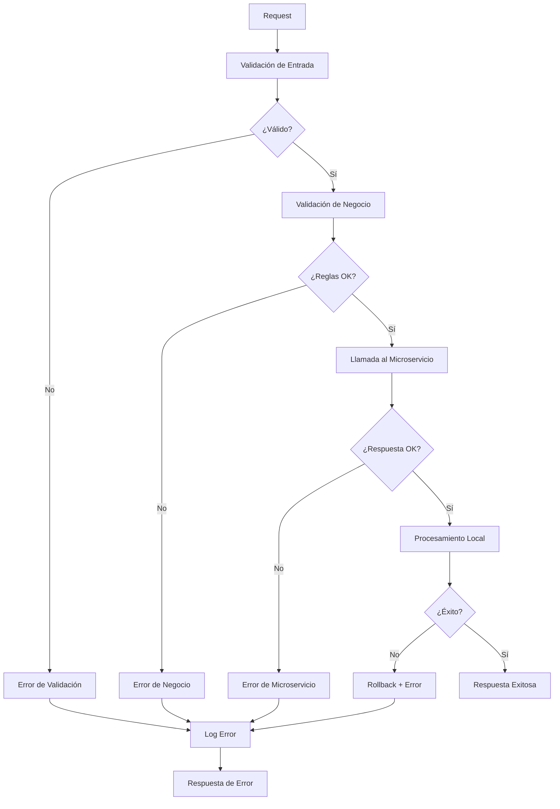

# Manejo de Errores

El sistema de órdenes de compra implementa un manejo robusto de errores con múltiples capas de validación, rollback automático y logging detallado.

## Arquitectura de Manejo de Errores



## Tipos de Errores

### 1. Errores de Validación

Errores en la estructura o formato de los datos de entrada.

<ResponseExample>
```json Error de Validación
{
  "success": false,
  "error_type": "VALIDATION_ERROR",
  "message": "Los datos proporcionados no son válidos",
  "errors": [
    {
      "field": "contact_email",
      "code": "INVALID_FORMAT",
      "message": "El formato del email no es válido"
    },
    {
      "field": "products",
      "code": "EMPTY_ARRAY",
      "message": "La lista de productos no puede estar vacía"
    }
  ],
  "timestamp": "2024-03-15T10:30:00Z",
  "request_id": "req_123456789"
}
```
</ResponseExample>

#### Validaciones Comunes

<AccordionGroup>
<Accordion title="Validación de Email">
```php
function validateEmail($email) {
    if (empty($email)) {
        throw new ValidationException('Email es requerido', 'REQUIRED_FIELD');
    }
    
    if (!filter_var($email, FILTER_VALIDATE_EMAIL)) {
        throw new ValidationException('Formato de email inválido', 'INVALID_FORMAT');
    }
    
    if (strlen($email) > 255) {
        throw new ValidationException('Email demasiado largo', 'MAX_LENGTH_EXCEEDED');
    }
}
```
</Accordion>

<Accordion title="Validación de Productos">
```php
function validateProducts($products) {
    if (empty($products)) {
        throw new ValidationException('Lista de productos vacía', 'EMPTY_ARRAY');
    }
    
    if (count($products) > 50) {
        throw new ValidationException('Máximo 50 productos por orden', 'MAX_ITEMS_EXCEEDED');
    }
    
    foreach ($products as $index => $product) {
        if (empty($product['product_id'])) {
            throw new ValidationException(
                "Product ID requerido en posición {$index}", 
                'REQUIRED_FIELD'
            );
        }
        
        if (!isset($product['product_quantity']) || $product['product_quantity'] < 1) {
            throw new ValidationException(
                "Cantidad debe ser mayor a 0 en posición {$index}", 
                'INVALID_QUANTITY'
            );
        }
    }
}
```
</Accordion>

<Accordion title="Validación de Dirección">
```php
function validateAddress($address) {
    $required_fields = [
        'address_country' => 'País',
        'address_state' => 'Estado',
        'address_city' => 'Ciudad',
        'address_street' => 'Calle',
        'address_ext_number' => 'Número exterior',
        'address_postal_code' => 'Código postal'
    ];
    
    foreach ($required_fields as $field => $label) {
        if (empty($address[$field])) {
            throw new ValidationException(
                "{$label} es requerido", 
                'REQUIRED_FIELD',
                $field
            );
        }
    }
    
    // Validar código postal mexicano
    if (!preg_match('/^\d{5}$/', $address['address_postal_code'])) {
        throw new ValidationException(
            'Código postal debe tener 5 dígitos', 
            'INVALID_POSTAL_CODE'
        );
    }
}
```
</Accordion>
</AccordionGroup>

### 2. Errores de Negocio

Errores relacionados con las reglas de negocio y estado del sistema.

<ResponseExample>
```json Error de Negocio
{
  "success": false,
  "error_type": "BUSINESS_ERROR",
  "message": "No se puede procesar la orden",
  "errors": [
    {
      "code": "INSUFFICIENT_POINTS",
      "message": "Puntos insuficientes. Requeridos: 15000, Disponibles: 12500",
      "details": {
        "required_points": 15000,
        "available_points": 12500,
        "deficit": 2500
      }
    }
  ],
  "timestamp": "2024-03-15T10:30:00Z",
  "request_id": "req_123456789"
}
```
</ResponseExample>

#### Validaciones de Negocio

<CodeGroup>
```php Validación de Puntos
function validateUserPoints($user_id, $required_points) {
    $user = $this->Users->get($user_id);
    
    if ($user->available_points < $required_points) {
        throw new BusinessException(
            'Puntos insuficientes',
            'INSUFFICIENT_POINTS',
            [
                'required_points' => $required_points,
                'available_points' => $user->available_points,
                'deficit' => $required_points - $user->available_points
            ]
        );
    }
}
```

```php Validación de Stock
function validateProductStock($product_id, $quantity) {
    $product = $this->Products->findByProductId($product_id)->first();
    
    if (!$product) {
        throw new BusinessException(
            'Producto no encontrado',
            'PRODUCT_NOT_FOUND',
            ['product_id' => $product_id]
        );
    }
    
    if (!$product->is_active) {
        throw new BusinessException(
            'Producto no disponible',
            'PRODUCT_INACTIVE',
            ['product_id' => $product_id]
        );
    }
    
    if ($product->stock < $quantity) {
        throw new BusinessException(
            'Stock insuficiente',
            'INSUFFICIENT_STOCK',
            [
                'product_id' => $product_id,
                'requested' => $quantity,
                'available' => $product->stock
            ]
        );
    }
}
```

```php Validación de Dirección de Usuario
function validateUserAddress($user_id) {
    $address = $this->UserAddresses
        ->find()
        ->where(['user_id' => $user_id, 'is_default' => true])
        ->first();
    
    if (!$address) {
        throw new BusinessException(
            'Usuario debe registrar una dirección de entrega',
            'NO_DELIVERY_ADDRESS',
            ['user_id' => $user_id]
        );
    }
    
    return $address;
}
```
</CodeGroup>

### 3. Errores del Microservicio

Errores provenientes de la comunicación con el microservicio externo.

<ResponseExample>
```json Error de Microservicio
{
  "success": false,
  "error_type": "MICROSERVICE_ERROR",
  "message": "Error en el servicio de órdenes",
  "errors": [
    {
      "code": "SERVICE_UNAVAILABLE",
      "message": "El microservicio no está disponible temporalmente",
      "details": {
        "service": "purchase-orders",
        "endpoint": "/api/orders",
        "http_status": 503,
        "retry_after": 300
      }
    }
  ],
  "timestamp": "2024-03-15T10:30:00Z",
  "request_id": "req_123456789"
}
```
</ResponseExample>

#### Manejo de Errores HTTP

<CodeGroup>
```php Cliente HTTP con Retry
class PurchaseOrderService {
    
    public function createOrder($payload, $max_retries = 3) {
        $attempt = 0;
        
        while ($attempt < $max_retries) {
            try {
                $response = $this->makeHttpRequest($payload);
                return $this->processResponse($response);
                
            } catch (NetworkException $e) {
                $attempt++;
                
                if ($attempt >= $max_retries) {
                    throw new MicroserviceException(
                        'Servicio no disponible después de ' . $max_retries . ' intentos',
                        'SERVICE_UNAVAILABLE',
                        [
                            'attempts' => $attempt,
                            'last_error' => $e->getMessage()
                        ]
                    );
                }
                
                // Espera exponencial: 1s, 2s, 4s
                sleep(pow(2, $attempt - 1));
            }
        }
    }
    
    private function processResponse($response) {
        $status_code = $response->getStatusCode();
        $body = json_decode($response->getStringBody(), true);
        
        switch ($status_code) {
            case 200:
            case 201:
                return $body;
                
            case 400:
                throw new MicroserviceException(
                    'Datos inválidos enviados al microservicio',
                    'INVALID_REQUEST',
                    $body['errors'] ?? []
                );
                
            case 401:
                throw new MicroserviceException(
                    'Error de autenticación con el microservicio',
                    'AUTHENTICATION_ERROR'
                );
                
            case 404:
                throw new MicroserviceException(
                    'Endpoint no encontrado',
                    'ENDPOINT_NOT_FOUND'
                );
                
            case 429:
                throw new MicroserviceException(
                    'Límite de rate limiting excedido',
                    'RATE_LIMIT_EXCEEDED',
                    ['retry_after' => $response->getHeaderLine('Retry-After')]
                );
                
            case 500:
            case 502:
            case 503:
            case 504:
                throw new MicroserviceException(
                    'Error interno del microservicio',
                    'INTERNAL_SERVER_ERROR',
                    ['http_status' => $status_code]
                );
                
            default:
                throw new MicroserviceException(
                    'Respuesta inesperada del microservicio',
                    'UNEXPECTED_RESPONSE',
                    ['http_status' => $status_code]
                );
        }
    }
}
```
</CodeGroup>

### 4. Errores de Sistema

Errores relacionados con la infraestructura y recursos del sistema.

<ResponseExample>
```json Error de Sistema
{
  "success": false,
  "error_type": "SYSTEM_ERROR",
  "message": "Error interno del sistema",
  "errors": [
    {
      "code": "DATABASE_CONNECTION_FAILED",
      "message": "No se pudo conectar a la base de datos",
      "details": {
        "component": "database",
        "error_code": 2002,
        "suggestion": "Verificar conectividad de red y estado del servidor"
      }
    }
  ],
  "timestamp": "2024-03-15T10:30:00Z",
  "request_id": "req_123456789"
}
```
</ResponseExample>

## Estrategias de Rollback

### Rollback de Carrito de Compras

<Warning>
Cuando falla el procesamiento de un carrito, se debe cancelar todas las órdenes creadas y restaurar el estado original.
</Warning>

<CodeGroup>
```php Rollback Automático
public function processShoppingCart($user_id) {
    $this->connection->begin(); // Iniciar transacción
    $created_orders = [];
    
    try {
        $cart_items = $this->getCartItems($user_id);
        
        foreach ($cart_items as $item) {
            // Crear orden en microservicio
            $order_response = $this->PurchaseOrderService->createOrder(
                $this->buildPayload($item)
            );
            
            // Crear orden local
            $local_order = $this->createLocalOrder($item, $order_response);
            $created_orders[] = $local_order;
            
            // Descontar puntos
            $this->deductUserPoints($user_id, $item['total_points']);
        }
        
        // Si todo sale bien, vaciar carrito
        $this->clearShoppingCart($user_id);
        
        $this->connection->commit();
        return $created_orders;
        
    } catch (\Throwable $e) {
        $this->connection->rollback();
        
        // Cancelar órdenes en microservicio
        foreach ($created_orders as $order) {
            try {
                $this->PurchaseOrderService->cancelOrder($order->order_reference);
            } catch (\Exception $cancel_error) {
                Log::error('Failed to cancel order: ' . $cancel_error->getMessage());
            }
        }
        
        // Re-lanzar excepción original
        throw $e;
    }
}
```

```php Rollback Manual
public function rollbackOrder($order_id, $reason) {
    $this->connection->begin();
    
    try {
        $order = $this->Orders->get($order_id);
        
        // Cancelar en microservicio
        $this->PurchaseOrderService->cancelOrder($order->order_reference);
        
        // Restaurar puntos al usuario
        $this->restoreUserPoints($order->buyer_reference, $order->total_points);
        
        // Actualizar estado local
        $order->status = 'CANCELLED';
        $order->cancellation_reason = $reason;
        $order->cancelled_at = new DateTime();
        $this->Orders->save($order);
        
        // Log de auditoría
        $this->logOrderCancellation($order_id, $reason);
        
        $this->connection->commit();
        
    } catch (\Exception $e) {
        $this->connection->rollback();
        throw $e;
    }
}
```
</CodeGroup>

### Rollback de Puntos

```php
class PointsService {
    
    public function deductPoints($user_id, $points, $order_id) {
        $transaction = $this->PointsTransactions->newEntity([
            'user_id' => $user_id,
            'order_id' => $order_id,
            'points' => -$points,
            'type' => 'DEDUCTION',
            'status' => 'PENDING',
            'created' => new DateTime()
        ]);
        
        $this->PointsTransactions->save($transaction);
        
        // Actualizar balance del usuario
        $this->Users->updateAll(
            ['available_points' => new QueryExpression('available_points - ' . $points)],
            ['id' => $user_id]
        );
        
        return $transaction;
    }
    
    public function rollbackPointsDeduction($transaction_id) {
        $transaction = $this->PointsTransactions->get($transaction_id);
        
        if ($transaction->status !== 'PENDING') {
            throw new BusinessException('Transaction cannot be rolled back');
        }
        
        // Crear transacción de rollback
        $rollback = $this->PointsTransactions->newEntity([
            'user_id' => $transaction->user_id,
            'order_id' => $transaction->order_id,
            'points' => abs($transaction->points), // Positivo para restaurar
            'type' => 'ROLLBACK',
            'reference_transaction_id' => $transaction_id,
            'created' => new DateTime()
        ]);
        
        $this->PointsTransactions->save($rollback);
        
        // Restaurar puntos al usuario
        $this->Users->updateAll(
            ['available_points' => new QueryExpression('available_points + ' . abs($transaction->points))],
            ['id' => $transaction->user_id]
        );
        
        // Marcar transacción original como cancelada
        $transaction->status = 'CANCELLED';
        $this->PointsTransactions->save($transaction);
    }
}
```

## Logging y Monitoreo

### Configuración de Logs

<CodeGroup>
```php Log Configuration
// En config/app.php
'Log' => [
    'default' => [
        'className' => 'Cake\Log\Engine\FileLog',
        'path' => LOGS,
        'file' => 'debug',
        'levels' => ['notice', 'info', 'debug'],
        'url' => env('LOG_DEBUG_URL', null),
    ],
    'error' => [
        'className' => 'Cake\Log\Engine\FileLog',
        'path' => LOGS,
        'file' => 'error',
        'levels' => ['warning', 'error', 'critical', 'alert', 'emergency'],
        'url' => env('LOG_ERROR_URL', null),
    ],
    'orders' => [
        'className' => 'Cake\Log\Engine\FileLog',
        'path' => LOGS,
        'file' => 'orders',
        'levels' => ['info', 'warning', 'error'],
        'scopes' => ['orders']
    ],
    'microservice' => [
        'className' => 'Cake\Log\Engine\FileLog',
        'path' => LOGS,
        'file' => 'microservice',
        'levels' => ['info', 'warning', 'error'],
        'scopes' => ['microservice']
    ]
]
```

```php Logging Helper
class OrderLogger {
    
    public static function logOrderCreation($order_data, $user_id) {
        Log::info('Order creation started', [
            'user_id' => $user_id,
            'products' => count($order_data['products']),
            'total_points' => $order_data['total_points'] ?? 0,
            'request_id' => self::getRequestId()
        ], ['orders']);
    }
    
    public static function logOrderSuccess($order_id, $microservice_response) {
        Log::info('Order created successfully', [
            'order_id' => $order_id,
            'microservice_order_id' => $microservice_response['order_id'] ?? null,
            'request_id' => self::getRequestId()
        ], ['orders']);
    }
    
    public static function logOrderError($error, $context = []) {
        Log::error('Order creation failed', [
            'error_message' => $error->getMessage(),
            'error_code' => $error->getCode(),
            'context' => $context,
            'request_id' => self::getRequestId(),
            'stack_trace' => $error->getTraceAsString()
        ], ['orders']);
    }
    
    public static function logMicroserviceCall($endpoint, $payload, $response = null, $error = null) {
        $log_data = [
            'endpoint' => $endpoint,
            'payload_size' => strlen(json_encode($payload)),
            'request_id' => self::getRequestId()
        ];
        
        if ($response) {
            $log_data['response_status'] = $response['status'] ?? 'unknown';
            Log::info('Microservice call successful', $log_data, ['microservice']);
        }
        
        if ($error) {
            $log_data['error'] = $error->getMessage();
            Log::error('Microservice call failed', $log_data, ['microservice']);
        }
    }
    
    private static function getRequestId() {
        return $_SERVER['HTTP_X_REQUEST_ID'] ?? uniqid('req_');
    }
}
```
</CodeGroup>

### Métricas y Alertas

<Info>
Implementa métricas para monitorear la salud del sistema y detectar problemas proactivamente.
</Info>

```php
class OrderMetrics {
    
    public function recordOrderAttempt($user_id, $product_count) {
        // Incrementar contador de intentos
        $this->incrementCounter('orders.attempts.total');
        $this->incrementCounter('orders.attempts.by_user', ['user_id' => $user_id]);
        
        // Registrar histograma de productos por orden
        $this->recordHistogram('orders.products_per_order', $product_count);
    }
    
    public function recordOrderSuccess($order_id, $processing_time) {
        $this->incrementCounter('orders.success.total');
        $this->recordHistogram('orders.processing_time', $processing_time);
    }
    
    public function recordOrderError($error_type, $error_code) {
        $this->incrementCounter('orders.errors.total');
        $this->incrementCounter('orders.errors.by_type', [
            'type' => $error_type,
            'code' => $error_code
        ]);
    }
    
    public function recordMicroserviceLatency($endpoint, $latency) {
        $this->recordHistogram('microservice.latency', $latency, [
            'endpoint' => $endpoint
        ]);
    }
    
    public function recordMicroserviceError($endpoint, $http_status) {
        $this->incrementCounter('microservice.errors.total');
        $this->incrementCounter('microservice.errors.by_endpoint', [
            'endpoint' => $endpoint,
            'status' => $http_status
        ]);
    }
}
```

## Troubleshooting

### Problemas Comunes

<AccordionGroup>
<Accordion title="Error: Puntos Insuficientes">
**Síntomas**: Usuario reporta tener puntos pero el sistema dice que son insuficientes.

**Diagnóstico**:
```sql
-- Verificar balance actual del usuario
SELECT id, email, available_points, total_earned_points 
FROM users 
WHERE id = [USER_ID];

-- Verificar transacciones recientes
SELECT * FROM points_transactions 
WHERE user_id = [USER_ID] 
ORDER BY created DESC 
LIMIT 10;

-- Verificar órdenes pendientes
SELECT COUNT(*), SUM(total_points) 
FROM orders 
WHERE buyer_reference = '[USER_ID]' 
  AND status IN ('PENDING', 'PROCESSING');
```

**Solución**:
1. Verificar si hay órdenes pendientes que tengan puntos "reservados"
2. Recalcular balance de puntos ejecutando el proceso de conciliación
3. Si es necesario, ajustar manualmente el balance con justificación
</Accordion>

<Accordion title="Error: Producto No Disponible">
**Síntomas**: Producto aparece en catálogo pero falla al intentar canjearlo.

**Diagnóstico**:
```sql
-- Verificar estado del producto
SELECT product_id, name, is_active, stock, points_required 
FROM products 
WHERE product_id = '[PRODUCT_ID]';

-- Verificar configuración en microservicio
-- (Requiere consulta al microservicio)
```

**Solución**:
1. Verificar que el producto esté activo en la base de datos local
2. Confirmar que el producto existe en el microservicio
3. Verificar sincronización entre catálogo local y microservicio
4. Actualizar cache de productos si es necesario
</Accordion>

<Accordion title="Error: Microservicio No Responde">
**Síntomas**: Timeouts o errores 503/504 al crear órdenes.

**Diagnóstico**:
```bash
# Verificar conectividad
curl -I https://microservice-url/health

# Verificar logs del sistema
tail -f logs/microservice.log

# Verificar métricas de latencia
grep "microservice.latency" logs/metrics.log | tail -20
```

**Solución**:
1. Verificar estado del microservicio con el equipo de infraestructura
2. Implementar circuit breaker si no está configurado
3. Aumentar timeout temporalmente si es necesario
4. Activar modo de degradación graceful si está disponible
</Accordion>

<Accordion title="Error: Documentos CEVER No Se Guardan">
**Síntomas**: Productos CEVER se procesan pero los documentos no se almacenan.

**Diagnóstico**:
```php
// Verificar permisos de directorio
$upload_path = Configure::read('App.uploadsPath') . 'cever_documents/';
if (!is_writable($upload_path)) {
    echo "Directory not writable: " . $upload_path;
}

// Verificar espacio en disco
$free_space = disk_free_space($upload_path);
echo "Free space: " . number_format($free_space / 1024 / 1024) . " MB";

// Verificar registros en BD
SELECT COUNT(*) FROM certificate_documents 
WHERE created >= DATE_SUB(NOW(), INTERVAL 1 DAY);
```

**Solución**:
1. Verificar y corregir permisos del directorio de uploads
2. Verificar espacio disponible en disco
3. Validar formato de imágenes base64 recibidas
4. Revisar logs de PHP para errores de escritura de archivos
</Accordion>
</AccordionGroup>

### Scripts de Diagnóstico

<CodeGroup>
```php Verificar Estado del Sistema
<?php
// scripts/system_health_check.php

class SystemHealthCheck {
    
    public function runAllChecks() {
        $results = [];
        
        $results['database'] = $this->checkDatabase();
        $results['microservice'] = $this->checkMicroservice();
        $results['file_system'] = $this->checkFileSystem();
        $results['recent_errors'] = $this->checkRecentErrors();
        
        return $results;
    }
    
    private function checkDatabase() {
        try {
            $connection = ConnectionManager::get('default');
            $result = $connection->execute('SELECT 1')->fetch();
            
            return [
                'status' => 'OK',
                'message' => 'Database connection successful'
            ];
        } catch (\Exception $e) {
            return [
                'status' => 'ERROR',
                'message' => 'Database connection failed: ' . $e->getMessage()
            ];
        }
    }
    
    private function checkMicroservice() {
        try {
            $http = new Client(['timeout' => 5]);
            $response = $http->get(Configure::read('Microservice.base_url') . '/health');
            
            return [
                'status' => 'OK',
                'message' => 'Microservice is responding',
                'response_time' => $response->getHeaderLine('X-Response-Time')
            ];
        } catch (\Exception $e) {
            return [
                'status' => 'ERROR',
                'message' => 'Microservice not responding: ' . $e->getMessage()
            ];
        }
    }
    
    private function checkFileSystem() {
        $upload_path = Configure::read('App.uploadsPath');
        
        $checks = [
            'writable' => is_writable($upload_path),
            'free_space_mb' => round(disk_free_space($upload_path) / 1024 / 1024),
            'cever_docs_dir' => is_dir($upload_path . 'cever_documents/')
        ];
        
        $status = $checks['writable'] && $checks['free_space_mb'] > 100 ? 'OK' : 'WARNING';
        
        return [
            'status' => $status,
            'details' => $checks
        ];
    }
    
    private function checkRecentErrors() {
        $error_log = LOGS . 'error.log';
        
        if (!file_exists($error_log)) {
            return ['status' => 'OK', 'message' => 'No error log found'];
        }
        
        $recent_errors = shell_exec("tail -100 {$error_log} | grep -c 'ERROR'");
        
        return [
            'status' => $recent_errors > 10 ? 'WARNING' : 'OK',
            'recent_error_count' => (int)$recent_errors
        ];
    }
}
```

```bash Script de Monitoreo
#!/bin/bash
# scripts/monitor_orders.sh

echo "=== Order System Health Check ==="
echo "Date: $(date)"
echo

# Check recent order activity
echo "Recent Orders (last hour):"
mysql -u$DB_USER -p$DB_PASS $DB_NAME -e "
SELECT 
    COUNT(*) as total_orders,
    SUM(CASE WHEN status = 'PENDING' THEN 1 ELSE 0 END) as pending,
    SUM(CASE WHEN status = 'CANCELLED' THEN 1 ELSE 0 END) as cancelled
FROM orders 
WHERE created >= DATE_SUB(NOW(), INTERVAL 1 HOUR);"

echo

# Check error rates
echo "Error Rates (last hour):"
grep -c "ERROR" logs/error.log | tail -1
grep -c "Order creation failed" logs/orders.log | tail -1

echo

# Check microservice connectivity
echo "Microservice Status:"
curl -s -o /dev/null -w "HTTP Status: %{http_code}, Response Time: %{time_total}s\n" \
    $MICROSERVICE_URL/health

echo

# Check disk space
echo "Disk Space:"
df -h $UPLOAD_PATH

echo "=== End Health Check ==="
```
</CodeGroup>

## Recuperación de Desastres

### Backup de Órdenes

<Warning>
Mantén backups regulares de las tablas críticas para poder recuperar órdenes en caso de falla del sistema.
</Warning>

```sql
-- Backup diario de órdenes
CREATE TABLE orders_backup_20240315 AS 
SELECT * FROM orders 
WHERE created >= '2024-03-15 00:00:00' 
  AND created < '2024-03-16 00:00:00';

-- Backup de documentos CEVER
CREATE TABLE certificate_documents_backup_20240315 AS
SELECT * FROM certificate_documents 
WHERE created >= '2024-03-15 00:00:00';

-- Backup de transacciones de puntos
CREATE TABLE points_transactions_backup_20240315 AS
SELECT * FROM points_transactions 
WHERE created >= '2024-03-15 00:00:00';
```

### Plan de Recuperación

1. **Identificar el alcance del problema**
2. **Activar modo de mantenimiento**
3. **Restaurar desde backup más reciente**
4. **Reconciliar con microservicio**
5. **Validar integridad de datos**
6. **Reactivar sistema**
7. **Monitorear estabilidad**

<Check>
Un manejo robusto de errores asegura la integridad del sistema y proporciona una experiencia confiable para los usuarios.
</Check>