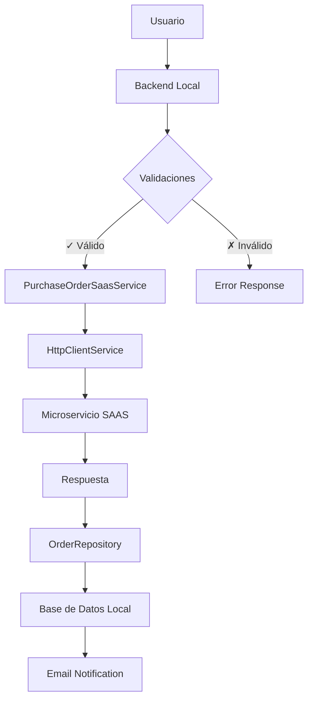

# Arquitectura del Microservicio de Órdenes

El sistema utiliza un **microservicio SAAS** para gestionar las órdenes de compra de productos de incentivos, manejando tanto canjes directos como carritos de compras completos.

## Arquitectura General

<Info>
El microservicio actúa como el sistema central de gestión de órdenes, mientras que el backend local maneja la lógica de negocio, validaciones y la gestión de puntos de los usuarios.
</Info>

### Componentes Principales

<CardGroup cols={2}>
<Card title="Backend Local" icon="server">
  Maneja validaciones, lógica de negocio, gestión de puntos y comunicación con el microservicio
</Card>

<Card title="Microservicio SAAS" icon="cloud">
  Sistema centralizado para crear, gestionar y procesar órdenes de compra
</Card>
</CardGroup>

## Clases de Comunicación

La comunicación se realiza mediante HTTP a través de las siguientes clases:

<Tabs>
<Tab title="HttpClientService.php">
**Propósito**: Cliente HTTP genérico para comunicación con servicios externos

**Responsabilidades**:
- Configuración de headers HTTP
- Manejo de autenticación Bearer
- Gestión de timeouts y reintentos
- Procesamiento de respuestas HTTP

```php
$headers = [
    'Content-Type: application/json',
    'Accept: application/json',
    'Authorization: Bearer ' . $token,
    'X-Company-Code: ' . $companyCode
];
```
</Tab>

<Tab title="PurchaseOrderSaasService.php">
**Propósito**: Servicio específico para operaciones de órdenes de compra

**Responsabilidades**:
- Construcción de payloads específicos
- Validación de datos antes del envío
- Transformación de respuestas del microservicio
- Manejo de errores específicos del dominio

```php
public function createOrder($profile, $address, $productId) {
    $payload = $this->buildOrderPayload($profile, $address, $productId);
    return $this->httpClient->post('/orders', $payload);
}
```
</Tab>

<Tab title="OrderRepository.php">
**Propósito**: Repositorio para manejo de órdenes y persistencia

**Responsabilidades**:
- Creación de órdenes en el microservicio
- Cancelación de órdenes en caso de error
- Consulta de estados de órdenes
- Sincronización con base de datos local

```php
public function createOrder($profile, $address, $productId) {
    $order = $this->saasService->createOrder($profile, $address, $productId);
    $this->saveLocalOrder($order);
    return $order;
}
```
</Tab>
</Tabs>

## Configuración del Sistema

### Variables de Entorno

<ParamField path="MICROSERVICE_BASE_URL" type="string" required>
URL base del microservicio de órdenes
</ParamField>

<ParamField path="MICROSERVICE_TOKEN" type="string" required>
Token de autenticación para el microservicio
</ParamField>

<ParamField path="COMPANY_CODE" type="string" required>
Código de la empresa cliente (ej: "MODELO_MX")
</ParamField>

<ParamField path="PROJECT_CODE" type="string" required>
Identificador del proyecto (ej: "incentive_mx")
</ParamField>

### Configuración HTTP

<CodeGroup>
```php Opciones cURL
$curlOptions = [
    CURLOPT_RETURNTRANSFER => true,
    CURLOPT_FOLLOWLOCATION => true,
    CURLOPT_SSL_VERIFYPEER => false,
    CURLOPT_TIMEOUT => 30,
    CURLOPT_HTTPHEADER => $headers
];
```

```php Headers por Defecto
$defaultHeaders = [
    'Content-Type: application/json',
    'Accept: application/json',
    'User-Agent: PurchaseOrderSystem/1.0'
];
```
</CodeGroup>

## Flujo de Datos



<Tip>
La arquitectura está diseñada para ser resiliente, con mecanismos de rollback automático y manejo robusto de errores para garantizar la consistencia de datos.
</Tip>